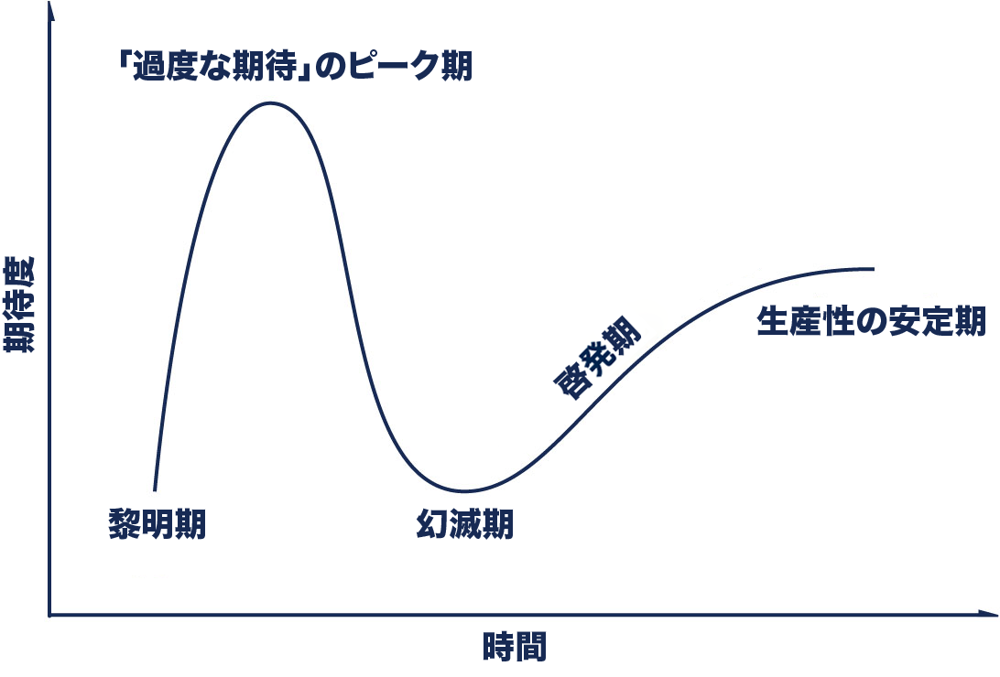

# はじめに
インナーソース ( InnerSource ) もプラットフォームエンジニアリング ( Platform Engineering ) も皆様にとって聞きなじみのある言葉でしょうか。  
どちらの概念も Gartner 社の発表する Hype Cycle for Software Engineering 2022 において黎明期にある、と発表されています。
(なおプラットフォームエンジニアリングについては Emerging Technologies Hype Cycle 2022 においても同様に黎明期にあるとされています)

<figcaption>ガートナー ハイプ・サイクル
<link href="https://www.gartner.co.jp/ja/research/methodologies/gartner-hype-cycle">
</figcaption>

# インナーソースについて
# プラットフォームエンジニアリングについて
# プロダクト型・セルフサービス型

